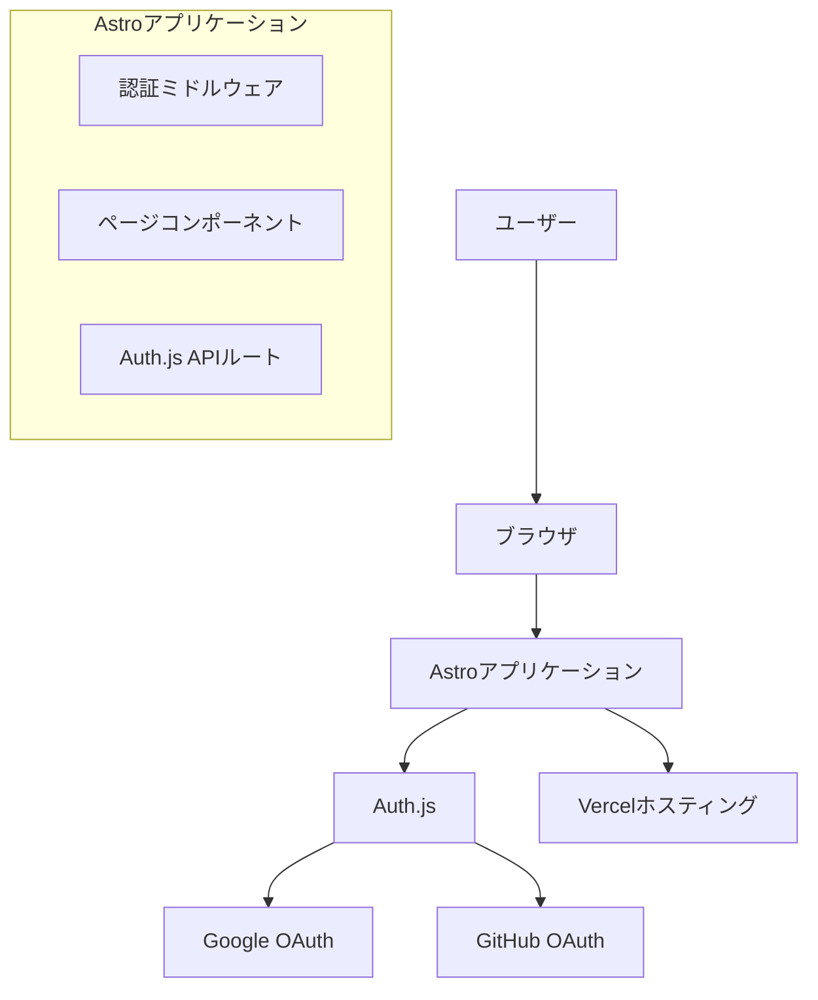
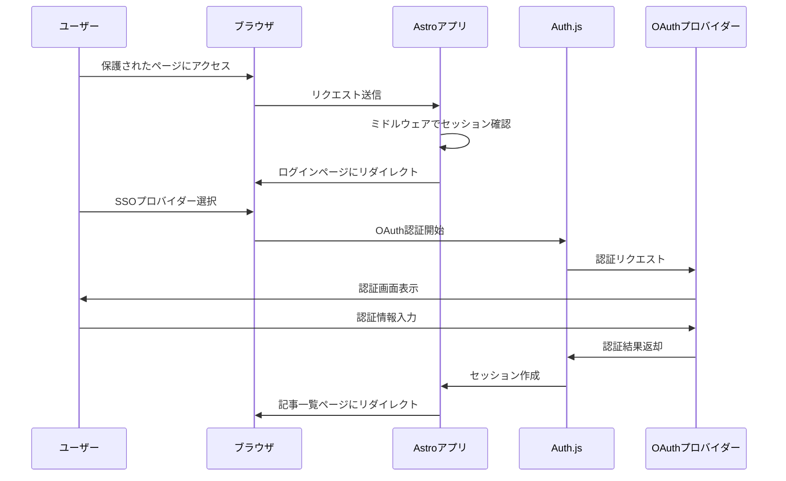

# 設計書

## 概要

TAMSAN Labの「Labが行く」プロジェクトにおけるSSO認証システムの設計書です。Auth.jsを使用してGoogleとGitHub OAuthによる認証を実装し、Astroのミドルウェア機能を活用してページアクセス制御を行います。

## アーキテクチャ

### 全体構成



### 認証フロー



## コンポーネントとインターフェース

### 1. Auth.js設定 (`src/lib/auth.ts`)

```typescript
interface AuthConfig {
  providers: Provider[];
  callbacks: {
    jwt: (params: JWTParams) => Promise<JWT>;
    session: (params: SessionParams) => Promise<Session>;
  };
  pages: {
    signIn: string;
    error: string;
  };
  session: {
    strategy: 'jwt';
    maxAge: number;
  };
}

interface AuthUser {
  id: string;
  name: string;
  email: string;
  image: string;
  provider: 'google' | 'github';
}
```

### 2. 認証ミドルウェア (`src/middleware/auth.ts`)

```typescript
interface MiddlewareContext {
  request: Request;
  url: URL;
  locals: {
    session?: Session;
    user?: AuthUser;
  };
}

interface AuthMiddleware {
  (context: MiddlewareContext, next: () => Promise<Response>): Promise<Response>;
}
```

### 3. セッション管理

```typescript
interface SessionManager {
  getSession(request: Request): Promise<Session | null>;
  createSession(user: AuthUser): Promise<string>;
  destroySession(sessionId: string): Promise<void>;
  validateSession(sessionId: string): Promise<boolean>;
}
```

### 4. 認証コンポーネント

```typescript
// AuthButton.astro用の型定義
interface AuthButtonProps {
  isAuthenticated: boolean;
  user?: AuthUser;
  variant: 'login' | 'logout';
}

// Header.astro用の型定義
interface HeaderProps {
  user?: AuthUser;
  currentPath: string;
}
```

## データモデル

### ユーザーセッション

```typescript
interface Session {
  user: {
    id: string;
    name: string;
    email: string;
    image: string;
  };
  expires: string;
  accessToken?: string;
}

interface JWT {
  sub: string;
  name: string;
  email: string;
  picture: string;
  provider: string;
  iat: number;
  exp: number;
}
```

### 環境変数

```typescript
interface AuthEnvironment {
  AUTH_SECRET: string;
  GOOGLE_CLIENT_ID: string;
  GOOGLE_CLIENT_SECRET: string;
  GITHUB_CLIENT_ID: string;
  GITHUB_CLIENT_SECRET: string;
  NEXTAUTH_URL: string;
}
```

## エラーハンドリング

### エラー分類と対応

```typescript
enum AuthErrorType {
  OAUTH_ERROR = 'oauth_error',
  SESSION_EXPIRED = 'session_expired',
  NETWORK_ERROR = 'network_error',
  CONFIGURATION_ERROR = 'configuration_error',
  ACCESS_DENIED = 'access_denied'
}

interface AuthError {
  type: AuthErrorType;
  message: string;
  redirectTo?: string;
  retryable: boolean;
}
```

### エラーハンドリング戦略

1. **OAuth認証エラー**
   - ユーザーフレンドリーなメッセージを表示
   - ログインページに戻る
   - エラー詳細をログに記録

2. **セッション期限切れ**
   - 自動的にログインページにリダイレクト
   - 期限切れメッセージを表示
   - 元のページURLを保持してログイン後にリダイレクト

3. **ネットワークエラー**
   - 再試行ボタンを表示
   - 一時的なエラーメッセージ
   - 自動リトライ機能（最大3回）

## テスト戦略

### 単体テスト

1. **認証ユーティリティ関数**
   - セッション検証ロジック
   - トークン処理関数
   - エラーハンドリング関数

2. **ミドルウェア**
   - 認証状態の判定
   - リダイレクト処理
   - セッション情報の設定

### 統合テスト

1. **認証フロー**
   - OAuth認証の完全なフロー
   - セッション作成と検証
   - ログアウト処理

2. **ページアクセス制御**
   - 保護されたページへのアクセス
   - 未認証時のリダイレクト
   - 認証後のページ表示

### E2Eテスト

1. **ユーザージャーニー**
   - ログインからログアウトまでの完全なフロー
   - 複数のOAuthプロバイダーでのテスト
   - エラーケースのテスト

## セキュリティ考慮事項

### 1. セッション管理

- **セキュアCookie**: `httpOnly`, `secure`, `sameSite`属性を設定
- **セッション期限**: 適切な有効期限（24時間）を設定
- **CSRF保護**: Auth.jsの内蔵CSRF保護を活用

### 2. OAuth設定

- **リダイレクトURI**: 許可されたドメインのみを設定
- **スコープ制限**: 必要最小限の権限のみを要求
- **状態パラメータ**: CSRF攻撃を防ぐための状態検証

### 3. 環境変数管理

- **シークレット管理**: 本番環境では環境変数で管理
- **キーローテーション**: 定期的なシークレットキーの更新
- **アクセス制御**: 環境変数へのアクセス制限

## パフォーマンス最適化

### 1. セッション管理

- **JWTトークン**: サーバーサイドセッションストレージを不要にする
- **キャッシュ戦略**: セッション情報の適切なキャッシュ
- **トークン更新**: 自動的なトークンリフレッシュ

### 2. ページロード最適化

- **ミドルウェア最適化**: 最小限の処理でセッション確認
- **静的生成**: 認証不要なページは静的生成
- **プリロード**: 認証後のページリソースのプリロード

## 実装詳細

### ファイル構成

```
src/
├── lib/
│   ├── auth.ts              # Auth.js設定
│   └── auth-utils.ts        # 認証ユーティリティ
├── middleware/
│   └── auth.ts              # 認証ミドルウェア
├── pages/
│   ├── api/
│   │   └── auth/
│   │       └── [...auth].ts # Auth.js APIルート
│   ├── login.astro          # ログインページ
│   ├── articles/
│   │   ├── index.astro      # 記事一覧（保護）
│   │   └── [slug].astro     # 記事詳細（保護）
│   └── index.astro          # トップページ
├── components/
│   ├── AuthButton.astro     # 認証ボタン
│   └── Header.astro         # ヘッダー（認証状態表示）
└── middleware.ts            # Astroミドルウェアエントリーポイント
```

### 依存関係

```json
{
  "dependencies": {
    "@auth/core": "^0.37.2",
    "astro": "^5.14.1"
  }
}
```

### 環境変数設定

```bash
# .env.local
AUTH_SECRET="your-secret-key-here"
GOOGLE_CLIENT_ID="your-google-client-id"
GOOGLE_CLIENT_SECRET="your-google-client-secret"
GITHUB_CLIENT_ID="your-github-client-id"
GITHUB_CLIENT_SECRET="your-github-client-secret"
NEXTAUTH_URL="http://localhost:4321"
```